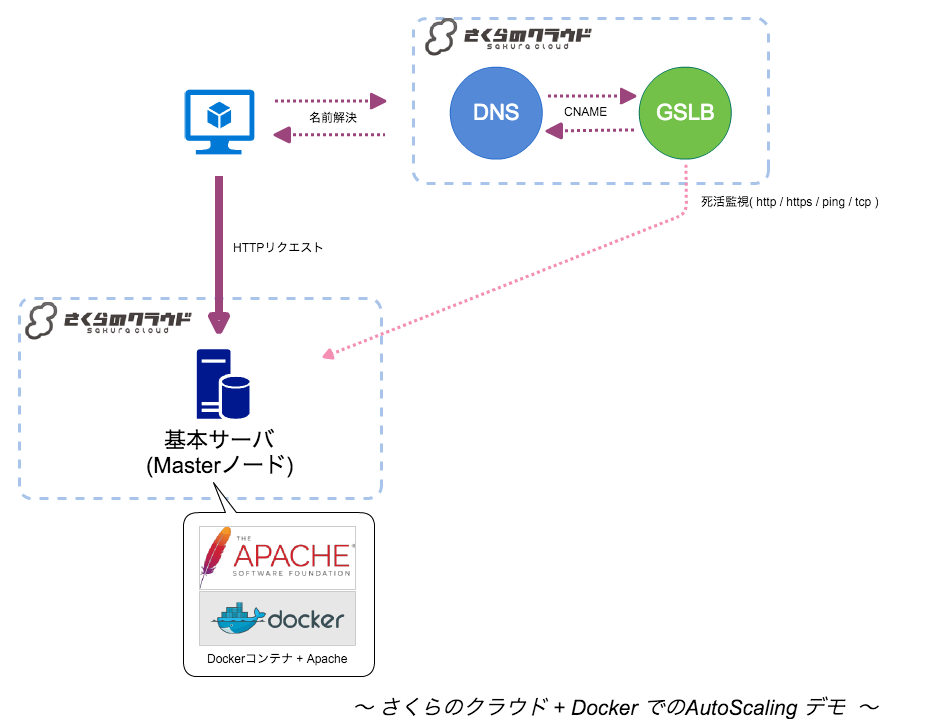
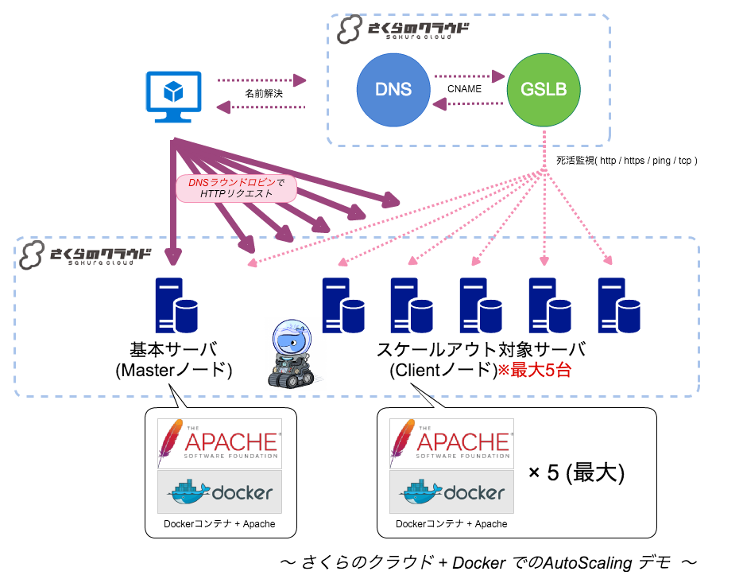

# sakura-auto-scaling-with-docker
さくらのクラウドでのDockerを用いたAutoScalingのサンプルです

## 注意
デモプログラムの実行により、課金対象のリソースが作成されます。その点ご留意の上、実行していただくようにお願いいたします。

# 概要

さくらのクラウドでAutoScalingを行うサンプルです。
GSLB(広域負荷分散)とDockerMachineを用いてスケーリングを行います。

#### 最小構成


#### スケールアウト時


## メリット/デメリット

### メリット

  - GSLBを用いるため、さくらのクラウド以外との連携が可能

    例：常に起動しておく基本マシンをさくらのVPSに置く。
        動的に増減する部分はさくらのクラウドに置く。

### デメリット

  - DNSベースの負荷分散のため、DNSキャッシュなどによりアクセスできないタイミングが発生する。

## AutoScalingの流れ

1) さくらのクラウドAPIでCPU負荷を測定

2) 閾値と比較しスケールイン/アウトを判断

3) docker-machineを用いてスケールイン/アウト実施

#### ポイント

> docker-machineでのマシン作成/削除時に
> GSLBヘのサーバー登録/削除も行われる。

## 前提条件

* ドメインを所有していること
* DNSレコードの追加が行えること
  (GSLBでCNAMEレコードの登録が必要)
* 以下がインストール済みであること
  - Docker
  - Docker Compose
  - Docker Machine
  - Docker Machine さくらのクラウド用ドライバ
    (docker-machine-sakuracloud)

## 実行手順

1) GitHubからデモプログラムをクローン

```bash
git clone https://github.com/yamamoto-febc/sakura-auto-scaling-with-docker.git
cd sakura-auto-scaling-with-docker.git
```

2) 設定ファイルの修正
   - さくらのクラウドAPIキーを設定

```bash
cp env.sample .env    # 設定ファイルひな形をコピー

vi .env               # 設定ファイルを編集


#==============================================================================
# APIキー(アクセストーン、シークレット)を記入してください
export SAKURACLOUD_ACCESS_TOKEN=your_access_token
export SAKURACLOUD_ACCESS_TOKEN_SECRET=your_access_token_secret

# 利用するリージョン(石狩第1、石狩第2、東京)を指定してください。
export SAKURACLOUD_REGION=is1a/is1b/tk1a
#==============================================================================
```

APIキー関連以外の設定項目は`settings.sh`に記載されています。
必要に応じて`settings.sh`を編集してください。
(基本的に変更しなくても動きます)

3) 初回起動
   - Masterノード作成(初回起動時に自動で作成される)
   - GSLB作成(初回起動時に自動で作成される)
   - DNSへGSLBホスト名をCNAME登録
   
```bash

chmod +x auto_scaling.sh
./auto_scaling.sh

```

以降はauto_scaling.shを実行するたびに負荷判定〜スケールイン/アウト処理が行われます。

4) 定期実行設定


```bash

crontab -e

# 5分ごとに実行する場合
*/5 * * * * /path/to/your/directory/auto_scaling.sh >> /var/log/sakura-auto-scaling.log 2>&1

```

  - **TODO 詳細を追記する**

## Author

* Kazumichi Yamamoto ([@yamamoto-febc](https://github.com/yamamoto-febc))
